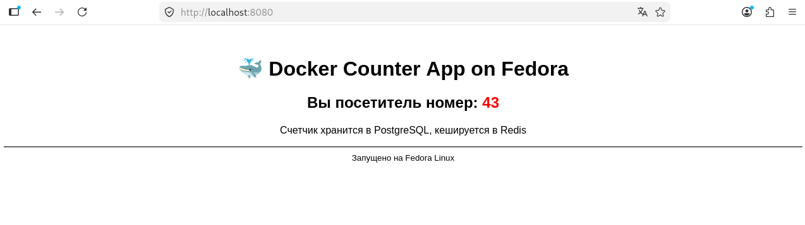
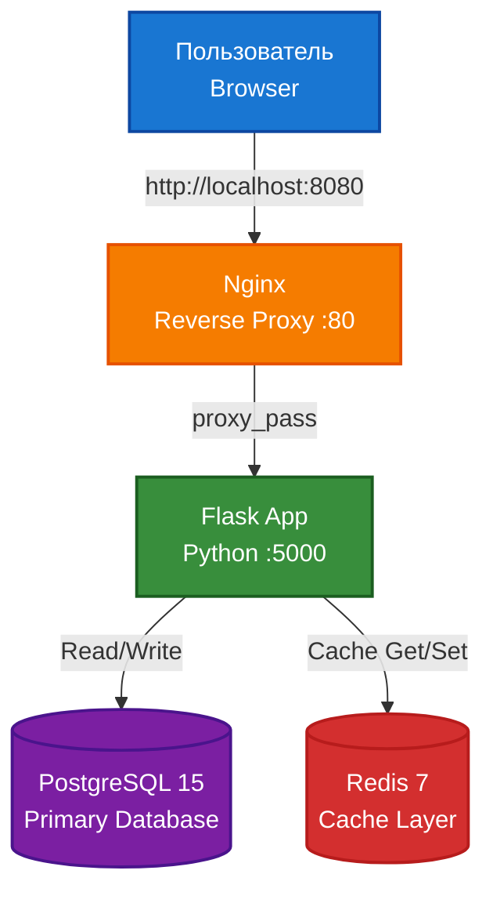
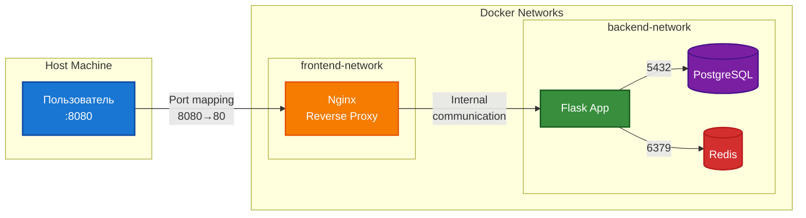
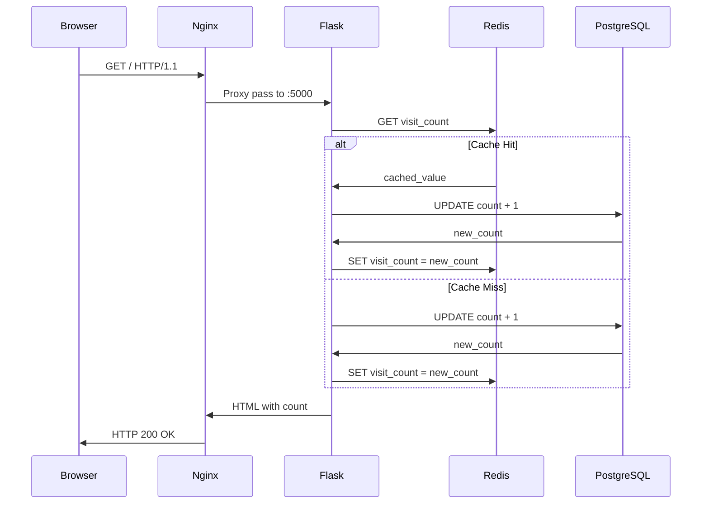
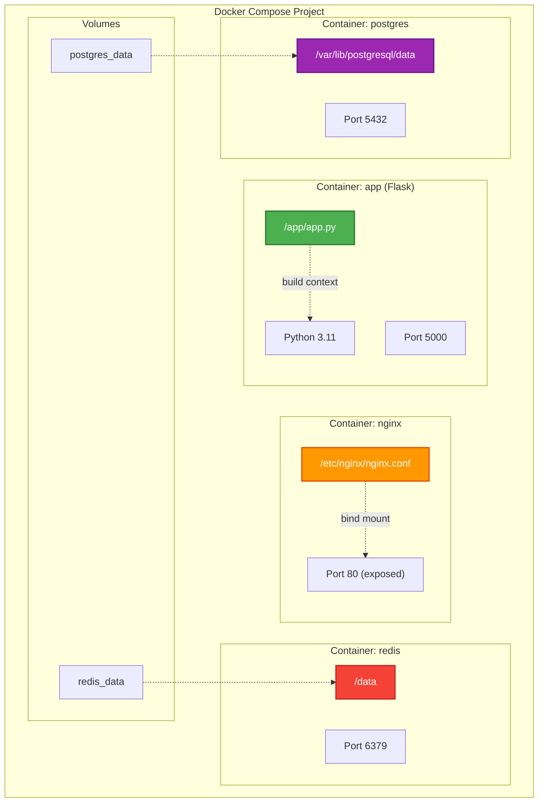

# 🐳 Docker Counter App


Production-ready многоконтейнерное приложение на Docker Compose с Flask, PostgreSQL, Redis и Nginx.

## 📋 Оглавление

- [Архитектура](#-архитектура)
- [Технологии](#-технологии)
- [Быстрый старт](#-быстрый-старт)
- [Команды для управления](#-команды-для-управления)
- [Технические детали](#-технические-детали)
- [Мониторинг и отладка](#-мониторинг-и-отладка)
- [Тестирование](#-тестирование)
- [Устранение проблем](#-устранение-проблем)

## 🖥 Интерфейс



## 🏗 Архитектура

### Общая архитектура приложения



### Схема сетевой изоляции


### Взаимодействие сервисов (Sequence Diagram)



### Контейнерная архитектура (Docker)



## ⚙️ Технологии

| Компонент | Технология | Версия | Назначение |
|-----------|------------|--------|------------|
| **Reverse Proxy** | Nginx | Alpine 1.25 | Балансировка, статика |
| **Web Framework** | Flask | 3.0 | API + Web UI |
| **База данных** | PostgreSQL | 15 Alpine | Persistent storage |
| **Кеш** | Redis | 7 Alpine | Кеширование |
| **Язык** | Python | 3.11 Slim | Application logic |

## 🚀 Быстрый старт

### Требования

- Docker 20.10+
- Docker Compose 2.0+
- Git (опционально)

## Установка и запуск

- 1. Клонировать репозиторий
git clone https://github.com/YOUR_USERNAME/docker-counter-project.git
cd docker-counter-project

- 2. Запустить все сервисы
docker compose up -d

- 3. Открыть в браузере
http://localhost:8080

- 4. Проверить статус
docker compose ps

## 📝 Команды для управления

- Запуск всех сервисов (фон)
docker compose up -d

- Остановка всех сервисов
docker compose down

- Перезапуск с пересборкой образов
docker compose up -d --build

- Просмотр логов
docker compose logs -f

- Масштабирование приложения
docker compose up -d --scale app=3

- Полная очистка (с удалением БД)
docker compose down -v

## Использование Makefile

- make help      # Показать все команды
- make up        # Запустить сервисы
- make down      # Остановить сервисы
- make logs      # Показать логи
- make clean     # Очистить всё (с volumes)
- make test      # Запустить нагрузочное тестирование

## 🔧 Технические детали

### Healthchecks
```bash
# PostgreSQL
healthcheck:
  test: ["CMD-SHELL", "pg_isready -U admin -d counter"]
  interval: 10s
  timeout: 5s
  retries: 5

# Flask App  
healthcheck:
  test: ["CMD", "curl", "-f", "http://localhost:5000/"]
  interval: 30s
  timeout: 3s
  retries: 3
```

### Изоляция сетей

- **frontend-network**: Только Nginx и Flask (публичный доступ)
- **backend-network**: PostgreSQL и Redis (приватные сети)

### Persistent Volumes

```yaml
volumes:
  postgres_data:  # Данные БД сохраняются
  redis_data:     # Кеш Redis переживает рестарты
```

## 📊 Мониторинг и отладка

### Проверка состояния
```bash
# Статус всех контейнеров
docker compose ps

# Healthcheck приложения
docker inspect counter-app | grep -A 5 "Health"

# Логи конкретного сервиса
docker compose logs --tail=50 postgres
```

### Проверка данных
```bash
# Просмотр счетчика в БД
docker exec -it counter-postgres psql -U admin -d counter -c "SELECT * FROM visits;"

# Просмотр кеша в Redis
docker exec -it counter-redis redis-cli get visit_count
```

## 🧪 Тестирование

### Smoke тесты
```bash
# 1. Проверка доступности
curl -I http://localhost:8080 | grep "200 OK"

# 2. Проверка ответа приложения
curl http://localhost:8080 | grep "счетчик"

# 3. Проверка healthcheck
curl http://localhost:8080/health
```

### Тест отказоустойчивости
```bash
# Остановка Redis (graceful degradation)
docker stop counter-redis
curl http://localhost:8080  # Должен работать через БД
docker start counter-redis   # Восстановление кеша
```

## 🐛 Устранение проблем

### Проблема 1: Порт 8080 уже используется
```bash
# Изменить порт в docker-compose.yml
ports:
  - "8081:80"  # вместо 8080:80
```

### Проблема 2: Permission denied на Linux
```bash
sudo usermod -aG docker $USER
newgrp docker
```

Проблема 3: База данных не создается
```yaml
# Полная перезагрузка с очисткой volumes
docker compose down -v
docker compose up -d
```

## 🗺️ Roadmap

-  Базовый функционал (Flask + PostgreSQL)
-  Redis кеширование
-  Nginx reverse proxy
-  Healthchecks и сети
-  Prometheus + Grafana
-  GitHub Actions CI/CD
-  Kubernetes deployment

## 📄 Лицензия

MIT License

## 👤 Автор

**Roman Petukhov**

- GitHub: [Roman](https://github.com/roman-vercetti)
- Проект: [docker-counter-project](https://github.com/roman-vercetti/docker-counter-project)